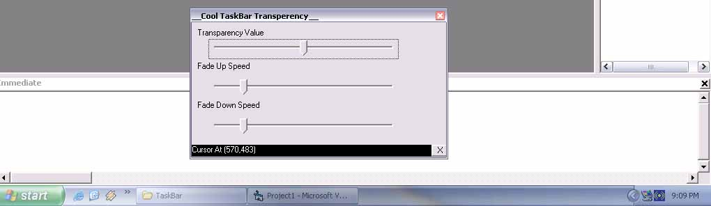



## \_\_\_Cool Taskbar Fade In/Out\_\_

### Description

This code makes your taskbar transparent when the mouse is not on it. When the mouse approaches the taskbar fades up. This is my first entry. U can also control the speen of fade ups and downs and the taskbar transparency level. Please enjoy thr code.
 
### More Info
 
Do not End the code from VB if so the taskbar may remain transparent till the next reboot. Please close the program.

             |
---                |---
**Submitted On**   |2005-01-19 10:55:02
**By**             |[Arun P \{:\-\)](https://github.com/Planet-Source-Code/PSCIndex/blob/master/ByAuthor/arun-p.md)
**Level**          |Beginner
**User Rating**    |4.9 (39 globes from 8 users)
**Compatibility**  |VB 6\.0
**Category**       |[Windows API Call/ Explanation](https://github.com/Planet-Source-Code/PSCIndex/blob/master/ByCategory/windows-api-call-explanation__1-39.md)
**World**          |[Visual Basic](https://github.com/Planet-Source-Code/PSCIndex/blob/master/ByWorld/visual-basic.md)
**Archive File**   |[\_\_\_Cool\_Ta1841641192005\.zip](https://github.com/Planet-Source-Code/arun-p-cool-taskbar-fade-in-out__1-58369/archive/master.zip)

